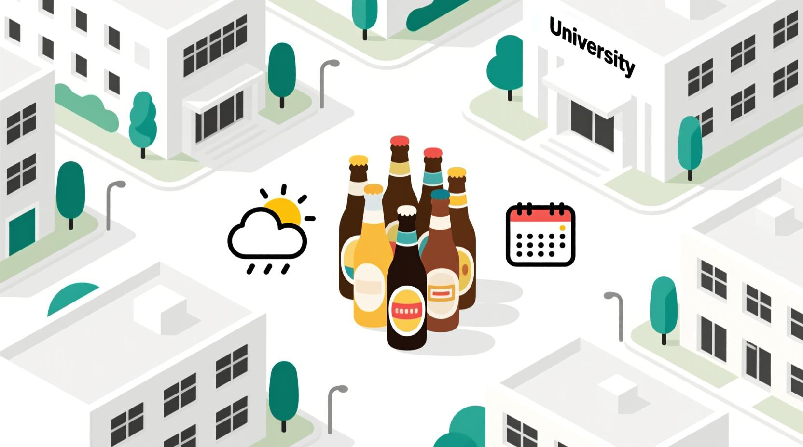
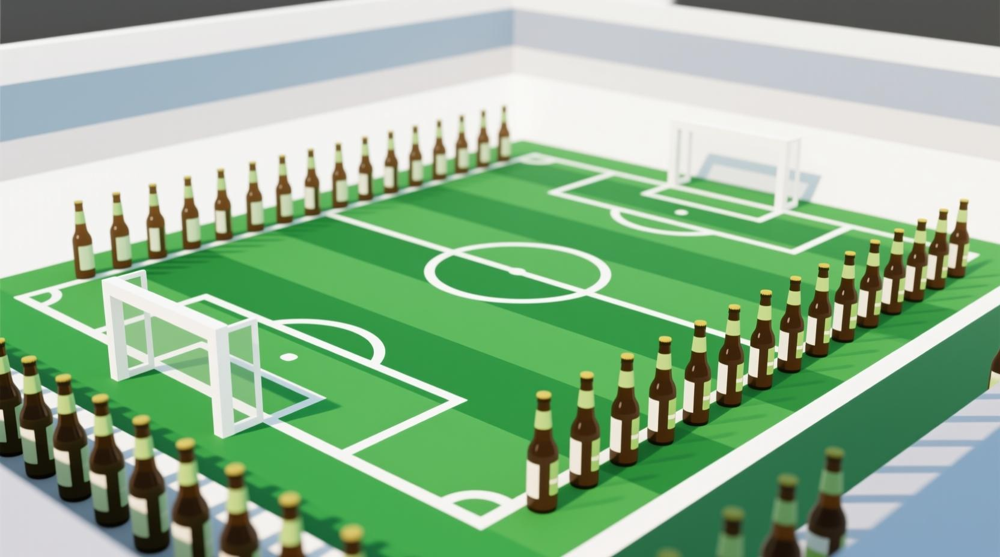
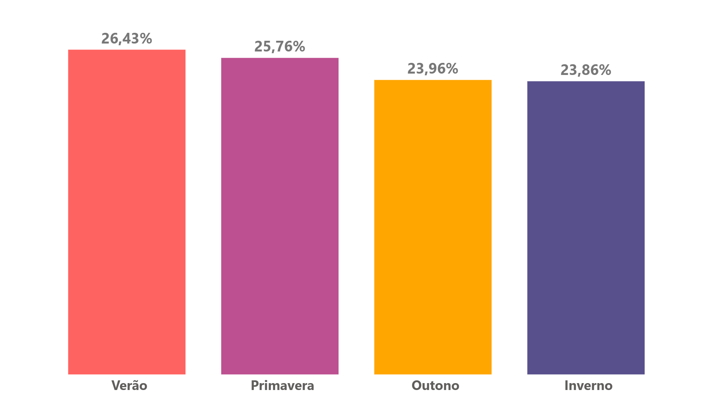

# Como o Clima e os Feriados Impactam o Consumo de Cerveja no Ambiente Universitário?

# Contexto

Este projeto analisa o consumo diário de cerveja em um bairro universitário de São Paulo, Brasil. Um ambiente social com festas e eventos frequentes, frequentado principalmente por estudantes entre 18 e 28 anos.

<aside>

Hipótese: **Clima, fins de semana e feriados impactam de forma significativa o consumo de cerveja em um ambiente universitário e social?**

</aside>

---

# Objetivo

Gerar insights acionáveis que possam apoiar o planejamento de estoque, campanhas de marketing e estratégias de distribuição, especialmente em áreas com forte presença universitária.

---

## Fonte de Dados

> **Período:** Ano completo (2015)
> 

> **Local:** Área universitária em São Paulo, Brasil
> 

> **Público:** Estudantes universitários (média de 18 a 28 anos)
> 

**7 atributos, incluindo:**

- Consumo diário de cerveja (variável alvo)
- Temperatura média
- Precipitação (chuva)
- Data
    
    

<aside>

### **Variáveis derivadas criadas para análise:**

</aside>

- **Dia da semana**
- **Indicador de fim de semana (sim/não) [incluindo sextas-feiras]**
- **Estação do ano**
- **Feriado nacional (sim/não)**
- **Média do consumo**

---

## Ferramentas Utilizadas

<aside>

**Power BI** e **Power Query** para transformação de dados, análise e dataviz

</aside>

---

# 11 Campos de futebol… De cerveja

## **27,27 milhões de long necks**

> Em 2015, a área universitária analisada registrou um consumo total de **9 milhões de litros de cerveja**. Esse volume é equivalente a aproximadamente **27,27 milhões de long necks de 330 ml**. Para ter uma dimensão física desse consumo, se colocássemos todas essas garrafas lado a lado, elas conseguiriam **cobrir cerca de 11 campos de futebol**, mostrando a intensidade do consumo neste ambiente social.
> 

# Sazonalidade

- **Verão** apresentou o maior consumo médio, seguido da **primavera**.
- **Inverno** mostrou queda acentuada, possivelmente influenciada pelo frio e recessos acadêmicos.

# A preferência, no entanto, continua “nem muito quente, nem muito frio”

Analisando os gráficos de temperatura mínima, temperatura máxima e temperatura média, podemos concluir que:

- Cerca de **65% do consumo total** ocorre em **temperaturas entre 20°C e 25°C**, indicando que esse intervalo concentra os maiores picos de consumo.
- O consumo é significativamente menor em temperaturas mais baixas (abaixo de 18°C) e em temperaturas mais altas (acima de 26°C).

Então, a preferência em beber cerveja é quando o clima está **agradável**, ideal para atividades sociais e ao ar livre, em vez de dias frios ou com calor extremo.

### Temperatura Mínima

### Temperatura Máxima

### Temperatura Média

# Top Meses de Consumo

- **Pico de Férias e Início do Ano:** O consumo em **Janeiro (Mês 1)** está **~16% acima da média anual**, refletindo o auge do verão e das férias.
- **Período de Provas:** Durante o **Mês 5 (Maio)**, o consumo cai para um patamar **~11% abaixo da média**, evidenciando a intensa dedicação aos estudos para as provas finais.
- **Recesso de Inverno:** O ponto mais baixo do ano, em Julho (Mês 7), registra um consumo ~13% menor que a média, mostrando o impacto direto das férias de inverno.
- **Retorno às Aulas e Fim de Ano:** O consumo em **Dezembro (Mês 12)** sobe para um patamar **~9% acima da média**, impulsionado pelas celebrações de formatura e final de ano.

# Fim de semana é festa

- Sábados, domingos e sexta-feiras tiveram, em média, até 25**% mais consumo** em comparação aos dias úteis.
- **Sextas-feiras,** mesmo com um consumo não tão grande quanto os outros, apresentaram um pequeno aumento marcando o início dos eventos do fim de semana.

Comparação da média do fim de semana com os dias comuns:

# Feriados e Datas Especiais

Feriados não geraram picos tão notáveis de consumo. Há um aumento sim comparando a média de consumo, mas de somente **0,8%**

# Quanto maior a chuva, menor o consumo de cerveja

**Chuvas leves ou moderadas durante o dia não reduzem significativamente o consumo**, que se mantém concentrado em sua maior parte em dias com até **50 mm de precipitação (chuva)**. 

Entretanto, quando o volume ultrapassa esse limite, observa-se uma **queda acentuada no consumo**, indicando que chuvas intensas têm impacto direto na demanda.

- **Até 50 mm** o consumo médio é de ~24,9 mil litros
- **Acima de 50 mm** o consumo médio cai para ~20,3 mil litros (uma redução de 18,5%)

---

# Conclusões

<aside>

> O consumo de cerveja em um ambiente universitário é **altamente sazonal e sensível ao clima e aos padrões do calendário**.
> 
</aside>

**Fins de semana com temperatura moderada (20 a 25°C) sem chuva ou com no máximo uma chuva leve** são os gatilhos mais consistentes para picos de demanda.

Marcas e distribuidores que atendem ao público jovem podem **aproveitar esses padrões** para planejar melhor marketing e logística.

---

# Quais seriam os próximos passos?

- Enriquecer o dataset com o calendário dos eventos locais
- Adicionar dados de preço, promoções ou vendas reais
- Explorar modelos de previsão de demanda

---

Obrigado pela leitura!

# Sobre o autor

**Lucas Correa**

Data Storyteller | Dataviz | Analista de Dados & BI

Curioso por natureza e apaixonado por transformar dados em histórias visuais. Neste espaço, você encontrará meus projetos de visualização de dados, dashboards e análises.

Me acompanhe nas redes sociais:

[https://www.linkedin.com/in/correa-lucas/](https://www.linkedin.com/in/correa-lucas/)

[https://medium.com/@corlcs](https://medium.com/@corlcs)

[https://substack.com/@corlcs/posts](https://substack.com/@corlcs/posts)
